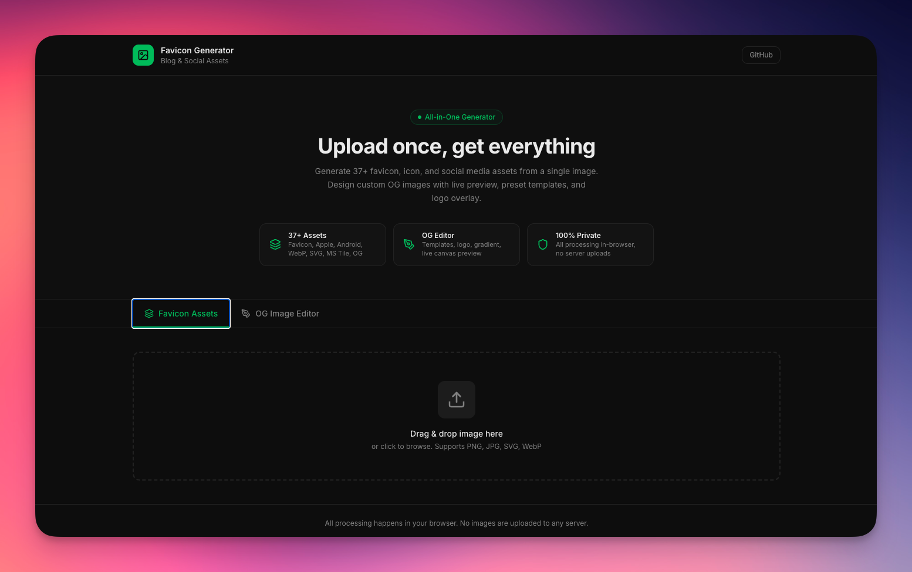

# Favicon Generator

<div align="center">
  
</div>

一站式博客与社交媒体资源生成器。上传一张图片，在浏览器内生成 37+ 种 favicon、图标与社交图资源；支持自定义 OG 图编辑与批量下载。

## 功能概览

- **Favicon 与图标**：从单张图片生成多种尺寸的 favicon、Apple Touch Icon、Android Chrome 图标、Microsoft Tile 等
- **社交 / OG 图**：生成 Open Graph、Twitter Card 等社交分享图
- **多格式**：PNG、ICO、WebP、SVG
- **OG 图编辑器**：预设模板、Logo 叠加、渐变与画布实时预览
- **隐私**：全部在浏览器内处理，图片不上传至任何服务器

## 技术栈

- **框架**：Next.js 16、React 19
- **样式**：Tailwind CSS、Radix UI、shadcn/ui 风格组件
- **工具**：Canvas API 图像处理、JSZip 批量打包下载

## 快速开始

### 环境要求

- Node.js 18+
- pnpm（推荐）或 npm / yarn

### 安装依赖

```bash
pnpm install
```

### 开发

```bash
pnpm dev
```

在浏览器中打开 [http://localhost:3000](http://localhost:3000)。

### 构建与运行

```bash
pnpm build
pnpm start
```

### 代码检查

```bash
pnpm lint
```

## 项目结构

```
src/
├── app/              # Next.js App Router 页面与布局
├── components/       # React 组件（上传区、资源网格、Favicon 生成器、OG 编辑器等）
└── lib/              # 业务逻辑与配置
    ├── asset-config.ts   # 资源尺寸与分类配置（37+ 项）
    ├── image-processor.ts # Canvas 裁剪、缩放、多格式导出
    └── utils.ts
```

## 生成的资源类型

| 分类       | 说明                         | 示例 |
|------------|------------------------------|------|
| Favicon    | 标准网站图标                 | 16×16、32×32、48×48 PNG，favicon.ico |
| Apple      | Apple Touch Icon 多尺寸      | 57–180px 等 |
| Android    | Android Chrome 图标          | 192、384、512px |
| Social/OG  | 社交分享图                   | og-image、twitter-card |
| MS Tile    | Microsoft 磁贴               | 70–310px 多种比例 |
| WebP       | WebP 格式图标与封面          | 多尺寸 + OG/封面 |
| SVG        | SVG 图标与 Logo              | favicon.svg、icon.svg、safari-pinned-tab 等 |

可在 `src/lib/asset-config.ts` 中增删或修改资源配置。

## 许可证

MIT
